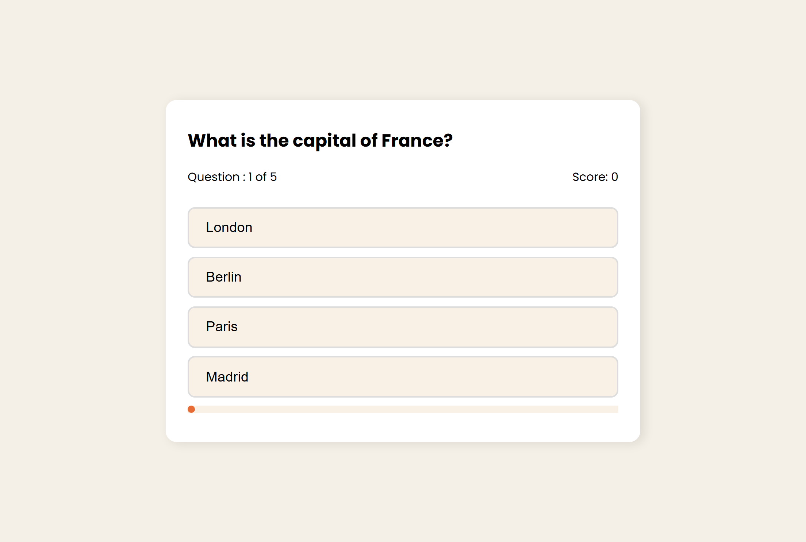

# 🧠 Quiz Game

A simple quiz game built with vanilla JavaScript.

🔗 **Live Site:** [simplequizappgame.netlify.app](https://simplequizappgame.netlify.app/)

## Screenshot



## How It Works

1. Open the game and click **Start Quiz**.
2. Pick one answer for each question. You can only choose one option.
3. After you pick, the quiz moves to the next question on its own.
4. At the end, you get a comment based on your score.

## Features

- ▶️ Start screen with a Start Quiz button
- ☝️ One answer per question
- ⏭️ Automatically moves to the next question
- 💬 Score-based comment at the end

## Built With

- HTML5
- CSS3
- Vanilla JavaScript

## Getting Started

```bash
git clone https://github.com/PriestEmma/Quiz-game.git
cd Quiz-game
```

Then open `index.html` in your browser.

---

Built by [Emma](https://github.com/PriestEmma) · [LinkedIn](https://www.linkedin.com/in/priestemma001)
